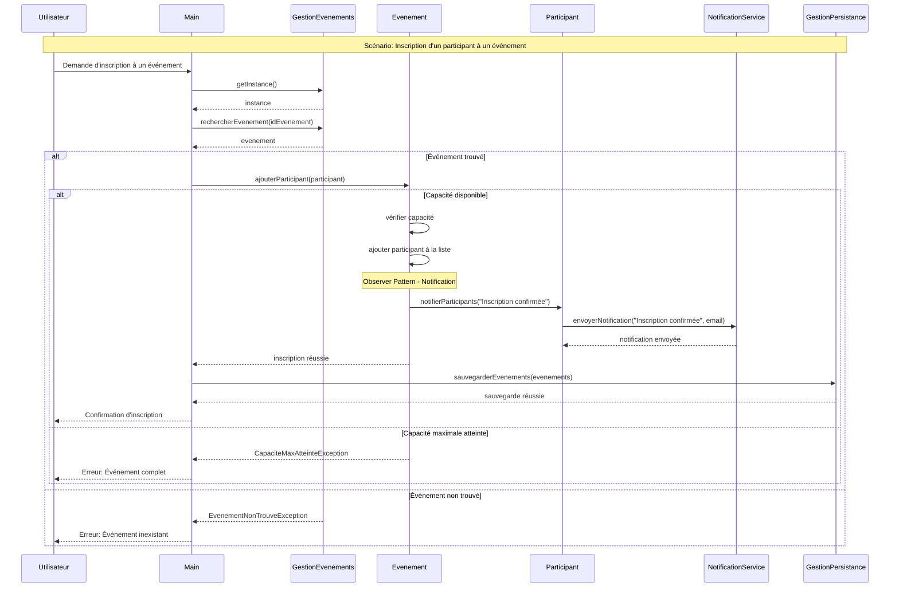
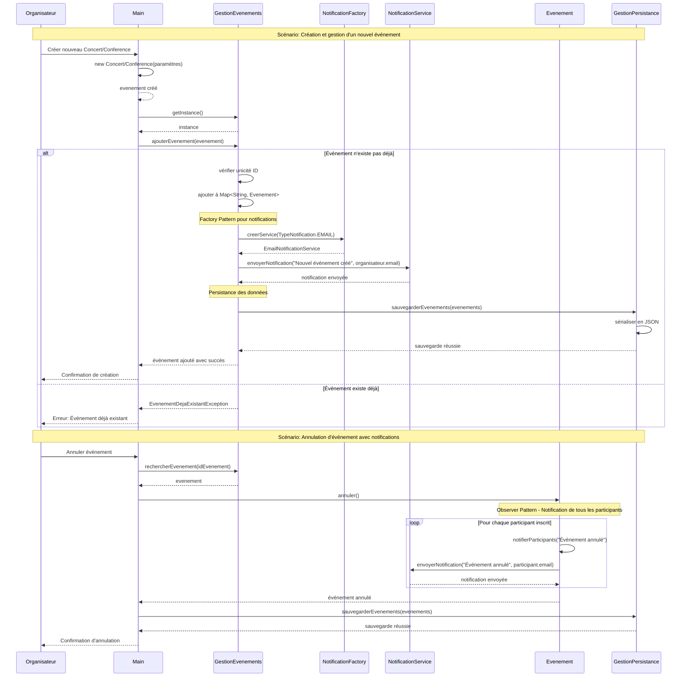

# 
HEUDEP DJANDJA BRIAN B 3GI 2025
# GestionEvents

##  Description
Ce projet permet de gérer différents types d'événements (**conférences, concerts**), avec :
- **Inscription des participants**
- **Gestion des organisateurs**
- **Notifications en temps réel (Observer)**
- **Persistance des données (JSON)**

##  Structure du projet
- `Evenement.java` : Classe abstraite des événements
- `Conference.java`, `Concert.java` : Sous-classes spécialisées
- `GestionEvenements.java` : **Singleton**
- `NotificationService.java` : **Interface pour l'envoi de notifications**
- `EvenementObservable.java` et `ParticipantObserver.java` : **Observer Pattern**
- `CapaciteMaxAtteinteException.java` , `EvenementDejaExistantException.java` ...etc : **Exceptions personnalisées**

```
GestionEvents/
├── src/
│    ├── main/
│    │    ├── java/
│    │    │    ├── models/
│    │    │    │    ├── Evenement.java
│    │    │    │    ├── Conference.java
│    │    │    │    ├── Concert.java
│    │    │    │    ├── Participant.java
│    │    │    │    ├── Organisateur.java
│    │    │    │    ├── Intervenant.java
│    │    │    ├── service/
│    │    │    │    ├── NotificationService.java
│    │    │    │    ├── EmailNotificationService.java
│    │    │    │    ├── SMSNotificationService.java
│    │    │    ├── gestion/
│    │    │    │    ├── GestionEvenements.java
│    │    │    ├── persistence/
│    │    │    │    ├── GestionPersistance.java
│    │    │    ├── observer/
│    │    │    │    ├── EvenementObservable.java
│    │    │    │    ├── ParticipantObserver.java
│    │    │    ├── exceptions/
│    │    │    │    ├── CapaciteMaxAtteinteException.java
│    │    │    │    ├── EvenementDejaExistantException.java
│    │    │    │    ├── EvenementNonTrouveException.java
│    │    │    │    ├── ParticipantDejaInscritException.java
│    │    │    ├── factory/
│    │    │    │    ├── NotificationFactory.java
│    │    │    ├── Main.java
│    │    ├── resources/
│    │    │    ├── evenements.json
│    │    │    ├── participants.json
│    ├── test/
│    │    ├── java/
│    │    │    ├── tests/
│    │    │    │    ├── GestionEvenementsTest.java
│    │    │    │    ├── EvenementTest.java
│    │    │    │    ├── GestionPersistanceTest.java
├── pom.xml
├── README.md
├── .gitignore
```

##  Technologies utilisées

- Java 14+
- JavaFX pour l'interface graphique
- Jackson pour la sérialisation/désérialisation JSON
- JUnit 5 pour les tests unitaires
- Maven pour la gestion des dépendances et du build
- Programmation orientée objet (POO)

##  Design Patterns implémentés

- **Singleton** : Pour la classe GestionEvenements
- **Observer** : Pour la notification des participants
- **Factory** : Pour la création des services de notification
- **Strategy** : Pour les différents types de notification (Email, SMS)

##  Fonctionnalités

-  Modèle `Evenement` avec sous-types Concert et Conference
-  Gestion des participants et organisateurs
-  Système de notification en temps réel (Observer Pattern)
-  Persistance des données en JSON
-  Interface utilisateur JavaFX
-  Tests unitaires avec JUnit 5

## 📊 Diagrammes UML

###  Diagramme de Classes

```mermaid
classDiagram
    %% Classes principales
    class Evenement {
        <<abstract>>
        -String id
        -String nom
        -LocalDateTime date
        -String lieu
        -int capaciteMax
        -List~Participant~ participants
        +ajouterParticipant(Participant p)
        +retirerParticipant(Participant p)
        +annuler()
        +afficherDetails()
        +notifierParticipants(String message)
    }

    class Conference {
        -String theme
        -List~Intervenant~ intervenants
        +ajouterIntervenant(Intervenant i)
        +afficherDetails()
    }

    class Concert {
        -String artiste
        -String genreMusical
        +afficherDetails()
    }

    class Participant {
        -String id
        -String nom
        -String email
        +recevoirNotification(String message)
    }

    class Organisateur {
        -List~Evenement~ evenementsOrganises
        +ajouterEvenement(Evenement e)
        +gererEvenement(String idEvenement)
    }

    class Intervenant {
        -String specialite
        -String biographie
    }

    %% Singleton
    class GestionEvenements {
        <<singleton>>
        -Map~String, Evenement~ evenements
        -GestionEvenements instance
        +getInstance() GestionEvenements
        +ajouterEvenement(Evenement e)
        +supprimerEvenement(String id)
        +rechercherEvenement(String id)
        +listerEvenements()
    }

    %% Observer Pattern
    class EvenementObservable {
        <<interface>>
        +ajouterObserver(ParticipantObserver observer)
        +retirerObserver(ParticipantObserver observer)
        +notifierObservers(String message)
    }

    class ParticipantObserver {
        <<interface>>
        +update(String message)
    }

    %% Notification Services
    class NotificationService {
        <<interface>>
        +envoyerNotification(String message, String destinataire)
    }

    class EmailNotificationService {
        +envoyerNotification(String message, String email)
    }

    class SMSNotificationService {
        +envoyerNotification(String message, String telephone)
    }

    %% Factory
    class NotificationFactory {
        +creerService(TypeNotification type) NotificationService
    }

    %% Persistance
    class GestionPersistance {
        +sauvegarderEvenements(List~Evenement~ evenements)
        +chargerEvenements() List~Evenement~
        +sauvegarderParticipants(List~Participant~ participants)
        +chargerParticipants() List~Participant~
    }

    %% Exceptions
    class CapaciteMaxAtteinteException {
        +CapaciteMaxAtteinteException(String message)
    }

    class EvenementDejaExistantException {
        +EvenementDejaExistantException(String message)
    }

    class EvenementNonTrouveException {
        +EvenementNonTrouveException(String message)
    }

    class ParticipantDejaInscritException {
        +ParticipantDejaInscritException(String message)
    }

    %% Relations d'héritage
    Evenement <|-- Conference
    Evenement <|-- Concert
    Participant <|-- Organisateur
    Participant <|-- Intervenant

    %% Relations d'implémentation
    NotificationService <|.. EmailNotificationService
    NotificationService <|.. SMSNotificationService
    EvenementObservable <|.. Evenement
    ParticipantObserver <|.. Participant

    %% Relations d'association
    Conference "1" --> "*" Intervenant : contient
    Evenement "1" --> "*" Participant : inscrit
    Organisateur "1" --> "*" Evenement : organise
    GestionEvenements "1" --> "*" Evenement : gère
    NotificationFactory --> NotificationService : crée
    GestionEvenements --> GestionPersistance : utilise

    %% Relations d'exception
    GestionEvenements ..> CapaciteMaxAtteinteException : throws
    GestionEvenements ..> EvenementDejaExistantException : throws
    GestionEvenements ..> EvenementNonTrouveException : throws
    GestionEvenements ..> ParticipantDejaInscritException : throws
```



###  Diagramme de Séquence - Inscription à un Événement



###  Diagramme de Séquence - Création et Gestion d'Événement



##  Tests

Des tests unitaires complets sont inclus pour valider:
- La logique métier de GestionEvenements
- Les opérations sur les événements
- La persistance des données

## 🛠️ Installation

1. Clonez le projet :
   ```sh
   git clone https://github.com/BrianBrusly/GestionEvents.git
   ```

2. Importez le projet dans IntelliJ IDEA:
    - File > Open... > Sélectionnez le dossier du projet
    - IntelliJ devrait détecter automatiquement le fichier pom.xml

3. Construisez le projet avec Maven:
   ```sh
   mvn clean install
   ```

4. Exécutez l'application:
   ```sh
   mvn test
   mvn test jacoco:report
   ```

## 🎯 Choix de Conception

### Design Patterns utilisés

**1. Singleton (GestionEvenements)**
- **Pourquoi ?** On veut une seule instance qui gère tous les événements du système
- **Avantage :** Évite les doublons et centralise la gestion
- **Usage :** `GestionEvenements.getInstance()` partout dans l'application

**2. Observer (Notifications)**
- **Pourquoi ?** Les participants doivent être automatiquement notifiés des changements
- **Avantage :** Découplage entre les événements et les participants
- **Usage :** Quand un événement est annulé, tous les participants sont notifiés automatiquement

**3. Factory (NotificationFactory)**
- **Pourquoi ?** Créer différents types de notifications (Email, SMS) de façon flexible
- **Avantage :** Facilite l'ajout de nouveaux types de notification
- **Usage :** `NotificationFactory.creerService(TypeNotification.EMAIL)`

**4. Strategy (Services de notification)**
- **Pourquoi ?** Changer dynamiquement la méthode de notification
- **Avantage :** Permet d'utiliser Email ou SMS selon le contexte
- **Usage :** Même interface `NotificationService` pour tous les types

### Architecture modulaire

**Séparation en packages :**
- `models/` : Classes métier (Evenement, Participant...)
- `service/` : Services de notification
- `gestion/` : Logique de gestion principale
- `persistence/` : Sauvegarde des données
- `exceptions/` : Gestions d'erreurs personnalisées

**Pourquoi cette organisation ?**
- Code plus facile à maintenir
- Responsabilités bien séparées
- Facilite les tests unitaires

### Gestion des exceptions

**Exceptions personnalisées créées :**
- `CapaciteMaxAtteinteException` : Quand un événement est complet
- `EvenementDejaExistantException` : Évite les doublons
- `ParticipantDejaInscritException` : Évite les inscriptions multiples

**Pourquoi ?** Messages d'erreur clairs et gestion précise des cas d'erreur.

### Persistance JSON

**Choix de JSON plutôt que base de données/XML:**
- Plus simple à mettre en place
- Fichiers lisibles et modifiables
- Suffisant pour un projet éducatif
- Utilisation de Jackson pour la sérialisation automatique

##  Principes SOLID appliqués

1. **Single Responsibility Principle (SRP)** : Chaque classe a une responsabilité unique.
2. **Open/Closed Principle (OCP)** : Les classes sont ouvertes à l'extension mais fermées à la modification.
3. **Liskov Substitution Principle (LSP)** : Les sous-classes (Concert, Conference) peuvent remplacer la classe de base (Evenement).
4. **Interface Segregation Principle (ISP)** : Des interfaces spécifiques (EvenementObservable, ParticipantObserver) sont utilisées.
5. **Dependency Inversion Principle (DIP)** : La dépendance vers les abstractions plutôt que les implémentations concrètes.

##  Auteur
 ### HEUDEP DJANDJA BRIAN B 3I2025

> Développé par [BrianBrusly](https://github.com/BrianBrusly)
